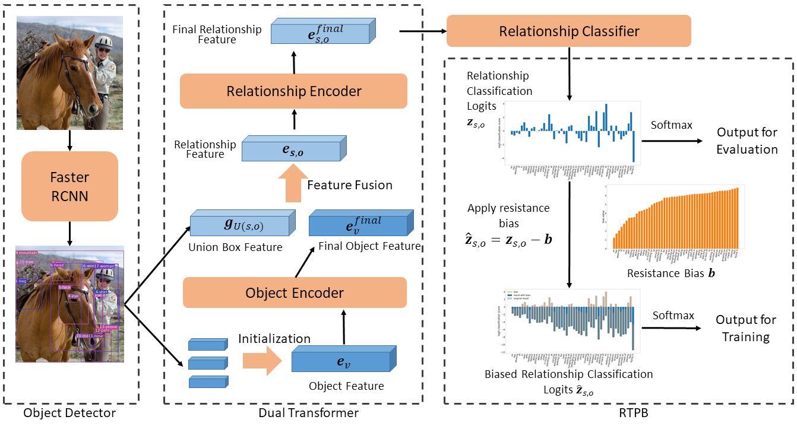

# Resistance Training using Prior Bias (RTPB)
This is an official implementation for AAAI 2022 paper "[Resistance Training using Prior Bias: toward Unbiased Scene Graph Generation](https://arxiv.org/abs/2201.06794)". 


## Contents

0. [Installation](#Installation)
1. [Dataset setup](#Dataset-setup)
2. [Config Introduction](#Config-Introduction)
3. [Training](#Training)
4. [Validation and Testing](#Validation-and-Testing)
5. [Models](#Models)

## Introduction

This project is based on the code of [Scene Graph Benchmark in Pytorch](https://github.com/KaihuaTang/Scene-Graph-Benchmark.pytorch). 

**Method overview**




## Installation

- Clone this repo
```bash
git clone https://github.com/ChCh1999/RTPB.git
cd RTPB
```

-  Create a conda virtual environment and activate it (**optional**)
```bash
conda create -n rtpb -y
conda activate rtpb
```

- prepare proper pytorch environment for your device. 

+ install dependencies

  ```
  conda install ipython scipy h5py
  pip install ninja yacs cython matplotlib tqdm opencv-python-headless overrides
  
  
  git clone https://github.com/cocodataset/cocoapi.git
  cd cocoapi/PythonAPI
  python setup.py build_ext install
  cd ../../
  
  # GPU and Cuda environment is necessary for proper compilation of this repo
  git clone https://github.com/NVIDIA/apex.git
  cd apex
  python setup.py install --cuda_ext --cpp_ext
  cd ../
  ```

  

- compile extensions and install this repo in `develop` mode

  **If your pytorch is 1.10.\* or older version, please use files in folder `csrc_backup` replace files in `maskrcnn_benchmark/csrc` first.**

  ```
  python setup.py build develop
  ```

  

## Dataset
see [DATASET.md](./DATASET.md)


## Training
#### Detector Fine-tune

```
CUDA_VISIBLE_DEVICES=0,1,2,3 python -m torch.distributed.launch --master_port 10001 --nproc_per_node=4 tools/detector_pretrain_net.py --config-file "configs/e2e_relation_detector_X_101_32_8_FPN_1x.yaml" SOLVER.IMS_PER_BATCH 8 TEST.IMS_PER_BATCH 4 DTYPE "float32" SOLVER.MAX_ITER 50000 SOLVER.STEPS "(30000, 45000)" SOLVER.VAL_PERIOD 2000 SOLVER.CHECKPOINT_PERIOD 2000 MODEL.RELATION_ON False SOLVER.PRE_VAL False OUTPUT_DIR /path/to/output 
```

###  Training on Scene Graph Generation

All training scripts are available in the folder [scripts](./scripts/)

if you want to train the model with multi gpus, replace the command like following sample:
```bash
# one card
python tools/relation_train_net.py --config-file 'configs/e2e_relation_X_101_32_8_FPN_1x_trans_predcls.yaml' SOLVER.IMS_PER_BATCH 16 TEST.IMS_PER_BATCH 1 DTYPE float32 SOLVER.MAX_ITER 18000 SOLVER.STEPS '(10000,16000)' SOLVER.WARMUP_ITERS 500 GLOVE_DIR /public/data1/users/chenchao278/model/glove MODEL.PRETRAINED_DETECTOR_CKPT $DET_CKPT OUTPUT_DIR $OUT_PATH SOLVER.PRE_VAL False MODEL.ROI_RELATION_HEAD.PREDICTOR 'DualTransPredictor' MODEL.ROI_RELATION_HEAD.DUAL_TRANS.USE_GRAPH_ENCODE True MODEL.ROI_RELATION_HEAD.DUAL_TRANS.GRAPH_ENCODE_STRATEGY trans
# four card
CUDA_VISIBLE_DEVICES=0,1,2,3 python -m torch.distributed.launch --master_port 10001 --nproc_per_node=4 --config-file 'configs/e2e_relation_X_101_32_8_FPN_1x_trans_predcls.yaml' SOLVER.IMS_PER_BATCH 16 TEST.IMS_PER_BATCH 4 DTYPE float32 SOLVER.MAX_ITER 18000 SOLVER.STEPS '(10000,16000)' SOLVER.WARMUP_ITERS 500 GLOVE_DIR /public/data1/users/chenchao278/model/glove MODEL.PRETRAINED_DETECTOR_CKPT $DET_CKPT OUTPUT_DIR $OUT_PATH SOLVER.PRE_VAL False MODEL.ROI_RELATION_HEAD.PREDICTOR 'DualTransPredictor' MODEL.ROI_RELATION_HEAD.DUAL_TRANS.USE_GRAPH_ENCODE True MODEL.ROI_RELATION_HEAD.DUAL_TRANS.GRAPH_ENCODE_STRATEGY trans
```


## Testing
```bash
python tools/relation_test_net.py --config-file '/path/to/config_file.yaml'
```


## Models
Here we provide our pretrained model, please see [Models.md](./Models.md)


## Citation

if RTPB is helpful for your research or you wish to refer the baseline results published here, we'd really appreciate it if you could cite this paper:
```
@misc{chen2022resistance,
      title={Resistance Training using Prior Bias: toward Unbiased Scene Graph Generation}, 
      author={Chao Chen and Yibing Zhan and Baosheng Yu and Liu Liu and Yong Luo and Bo Du},
      year={2022},
      eprint={2201.06794},
      archivePrefix={arXiv},
      primaryClass={cs.CV}
}
```

